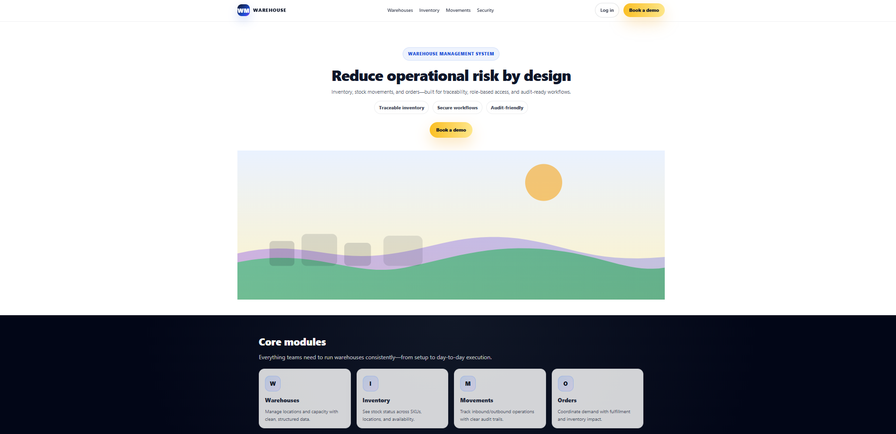
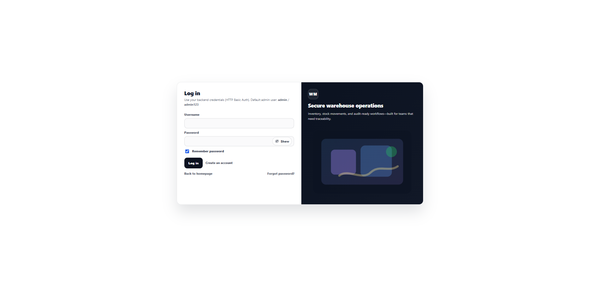
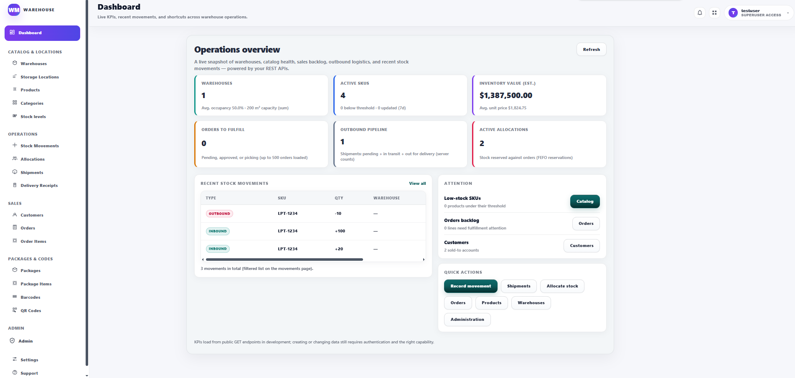
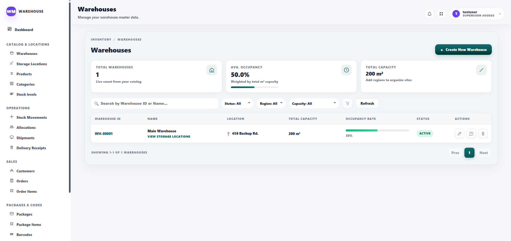
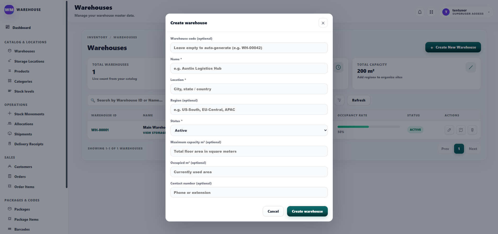
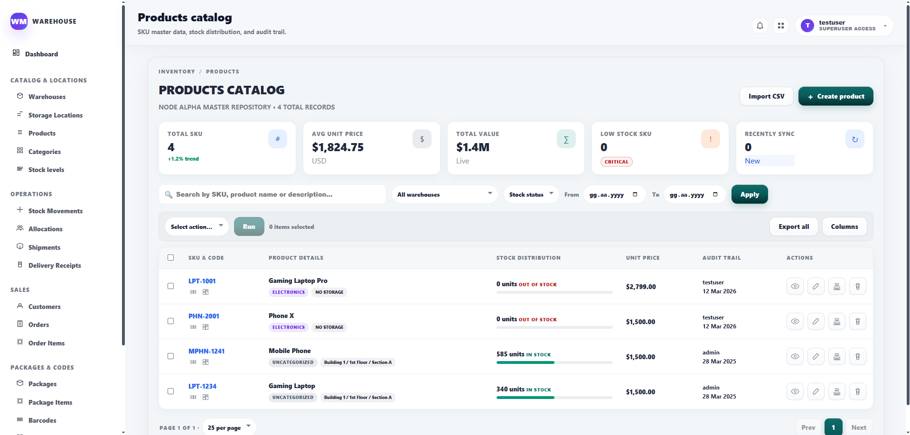
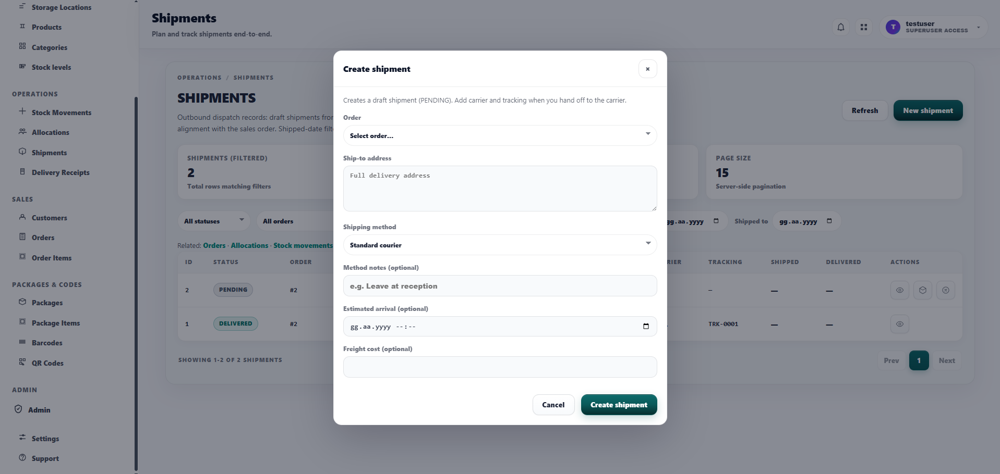
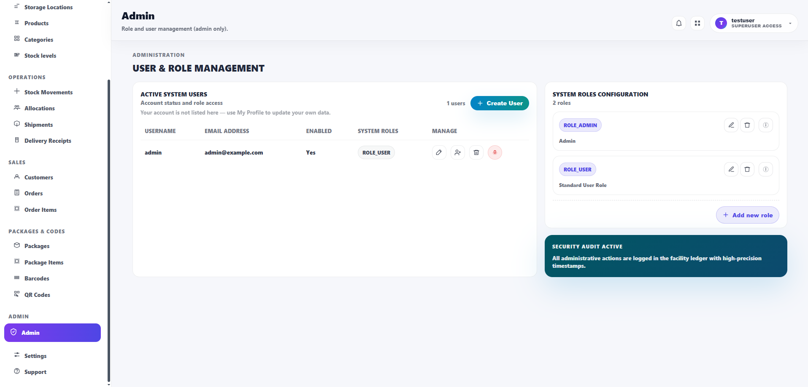

# Warehouse Management

A full-stack **warehouse operations** web application: catalog, inventory, orders, shipments, and admin. The backend exposes a **REST API**; the frontend is a **single-page app** with role-aware navigation and a shared design system.

---

## Highlights

| Area | What it demonstrates |
|------|----------------------|
| **Backend** | Spring Boot 3, JPA, Flyway migrations, Spring Security, layered services |
| **Frontend** | React 19, TypeScript, Vite, client-side routing, capability-based UI |
| **Domain** | Multi-warehouse stock, movements, allocations, shipments, delivery receipts, user profiles & consents |

---

## Tech stack

**Backend**

- Java 21, Spring Boot 3.4  
- Spring Data JPA, Bean Validation  
- Spring Security (JWT-oriented API security)  
- Flyway (database migrations)  
- H2 or file-based DB for local dev (see `application.properties`)

**Frontend**

- React 19, TypeScript  
- Vite 5  
- React Router 7  

**Tooling**

- Maven (backend), npm (frontend)  
- ESLint (frontend)

---

## Features (at a glance)

- **Public:** landing page, registration, login, email confirmation flow  
- **Dashboard:** module shortcuts and operational overview  
- **Catalog & locations:** warehouses, storage locations, products (catalog + detail), categories  
- **Inventory:** stock levels, stock movements, inventory allocations (incl. FEFO-style allocation on the API)  
- **Fulfillment:** orders, order items, shipments (create / ship / deliver), delivery receipts  
- **CRM:** customers  
- **Admin (capability-gated):** users, roles, assignments  
- **Account:** profile, settings, support  

---

## Screenshots

### Homepage



### Log in



### Dashboard



### Warehouses



### Warehouses Create pop-up



### Products Catalog



### Shipment Create pop-up



### Admin



More screens (landing, login, dashboard) can be added under [`docs/screenshots/`](docs/screenshots/); see [`docs/screenshots/README.md`](docs/screenshots/README.md).

---

## Architecture (brief)

- **API:** REST controllers → services → JPA repositories; DTOs for request/response boundaries  
- **Frontend:** Feature modules under `frontend/src/features/*`, pages under `frontend/src/pages/*`, shared layout and auth (`RequireAuth`, `RequireCapability`)  
- **Styling:** Central design tokens and components (`frontend/src/styles/design-system.css`)

---

## Getting started

### Prerequisites

- JDK 21+, Maven 3.9+  
- Node.js 20+ (LTS recommended), npm  

### Backend

```bash
./mvnw spring-boot:run
```

Or on Windows: `mvnw.cmd spring-boot:run`

Default API base is typically `http://localhost:8080` (check `application.properties` for context path and port).

### Frontend

```bash
cd frontend
npm install
npm run dev
```

Configure the API base URL in the frontend client if needed (`frontend/src/services/apiClient.ts` or env as wired in your branch).

### Build

```bash
./mvnw -q -DskipTests package
cd frontend && npm run build
```

---

## Repository layout

```
warehouse-management/
├── frontend/          # React (Vite) SPA
├── src/main/java/     # Spring Boot application
├── src/main/resources/
│   └── db/migration/  # Flyway SQL
├── pom.xml
└── README.md
```


---

## Author

Özgür Günay
